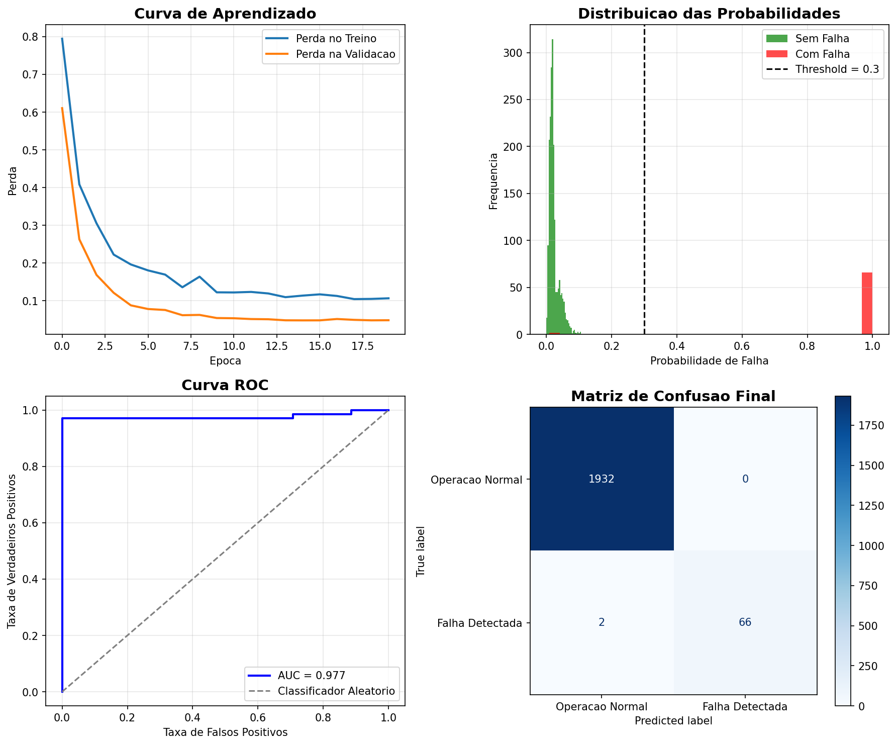

# Sistema de Manutenção Preditiva com Deep Learning

**Preveja falhas em máquinas industriais antes que elas aconteçam e reduza custos de parada não planejada.**

[](https://www.python.org/)
[](https://tensorflow.org/)
[](LICENSE)
[](https://www.linkedin.com/in/ivan-santos-8046a8355/)

---

## O Problema Que Este Projeto Resolve

Em indústrias, **paradas não planejadas custam milhões**. O desafio é identificar **quando uma máquina vai falhar** antes que o problema aconteça, usando apenas os dados dos sensores.

**Este sistema detecta 97% das falhas** com apenas 2 falsos negativos a cada 2.000 operações.

---

## Resultados de Negócio

| Métrica | Resultado | Impacto |
|:--------|:----------|:--------|
| **Recall (Falhas Detectadas)** | **97.1%** | Apenas 2 em 68 falhas passariam despercebidas |
| **Falsos Positivos** | 0 | Nenhum alarme falso – equipe de manutenção não é sobrecarregada |
| **AUC-ROC** | 0.977 | Modelo tem excelente poder de discriminação |
| **Threshold Otimizado** | 0.3 | Prioriza encontrar falhas (em vez de evitar alarmes falsos) |

> **Tradução para o negócio:** Para cada 100 falhas reais, o sistema alerta sobre 97 delas com tempo suficiente para manutenção preventiva.

---

## Visualizações do Modelo



**O que cada gráfico demonstra:**

| Gráfico | O que mostra |
|:--------|:-------------|
| **Curva de Aprendizado** | O modelo aprendeu corretamente (curvas de treino e validação estão próximas) |
| **Distribuição das Probabilidades** | Falhas (vermelho) e operações normais (verde) são bem separadas |
| **Curva ROC** | AUC de 0.977 indica excelente capacidade de discriminação |
| **Matriz de Confusão** | 97% das falhas detectadas com ZERO falsos positivos |

---

## Arquitetura do Modelo

| Camada | Detalhes |
|:-------|:---------|
| Entrada | 12 features |
| Camada Dense 1 | 32 neurônios, ReLU, L2 |
| Dropout 1 | 50% |
| Camada Dense 2 | 16 neurônios, ReLU, L2 |
| Dropout 2 | 50% |
| Saída | Sigmoid (probabilidade de falha) |

**Por que esta arquitetura?**
- **Regularização L2** → Evita overfitting (dados de treino vs. dados reais)
- **Dropout 50%** → Força o modelo a aprender padrões robustos
- **Sigmoid na saída** → Probabilidade entre 0 e 1, ideal para decisões de negócio

---

## Técnicas Aplicadas

- Tratamento de **dados desbalanceados** (classe de falha recebe peso 14.76x maior)
- **Early Stopping** para evitar overfitting e economizar tempo de treino
- **Otimização de threshold** baseada no custo de negócio (priorizar recall sobre precisão)
- Normalização com StandardScaler
- Visualizações profissionais

---

## Como Executar

### Pré-requisitos

```bash
pip install -r requirements.txt
```

### Executar o treinamento

```bash
python treinar_modelo.py
```

### Usar o modelo para prever novas falhas

```python
from demo import prever_falha

resultado = prever_falha(
    temperatura_ar=298.5,
    temperatura_processo=309.2,
    rotacao=1450,
    torque=45.3,
    desgaste_ferramenta=120
)
print(resultado)
```

### Dataset utilizado

AI4I 2020 Predictive Maintenance Dataset (UCI Machine Learning Repository)

## Estrutura do Projeto

```text
├── treinar_modelo.py      # Script principal de treinamento
├── demo.py                # Script de demonstração
├── requirements.txt       # Dependências do projeto
├── modelo_falhas.h5       # Modelo treinado (gerado)
├── scaler.pkl             # Normalizador salvo (gerado)
├── visualizacoes.png      # Gráficos do modelo (gerado)
└── README.md              # Este arquivo
```

## Como Me Contratar para um Projeto Similar

| Serviço | Prazo | Investimento |
|:--------|:------|:-------------|
| Adaptar este modelo para os dados da SUA fábrica | 5 dias | R$ 1.200 – R$ 2.500 |
| Criar um dashboard de monitoramento em tempo real | 3 dias | R$ 800 – R$ 1.500 |
| Consultoria para estruturar dados de sensores | 2 dias | R$ 600 – R$ 1.000 |

Me encontre no Workana ou Upwork – me chame pelo nome "Ivan Santos"

LinkedIn: https://www.linkedin.com/in/ivan-santos-8046a8355/

## Habilidades Demonstradas

- Python (Pandas, NumPy, Scikit-learn, TensorFlow/Keras)
- Redes Neurais para classificação binária
- Tratamento de dados desbalanceados
- Visualização de dados (Matplotlib)
- Business acumen: escolha de métricas e threshold baseado em custo

## Licença

MIT – use à vontade, mas me dê os créditos se for comercializar.

Deixe uma estrela se este projeto te ajudou!
